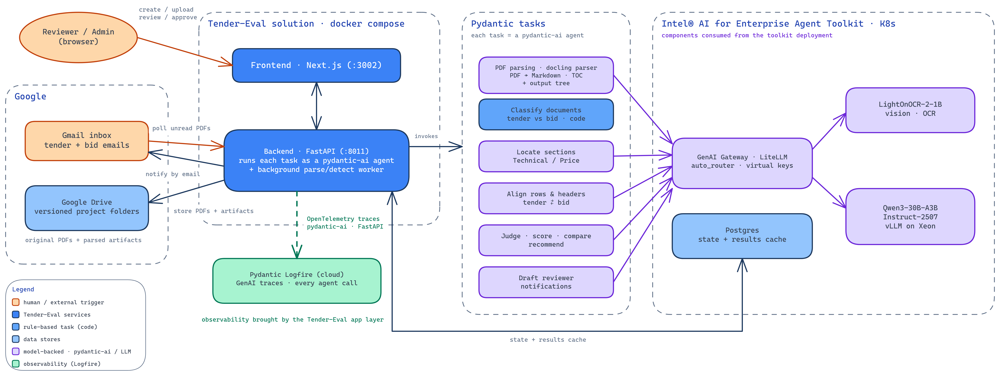

# Tender Evaluation

An AI-assisted pipeline that reads incoming tender and bid PDFs straight from Gmail, OCRs
them into structured data, finds and aligns their Technical Requirements and Price sections
across every bidder, and produces a plain-language, traceable comparison — with a human
reviewer approving or correcting every AI suggestion along the way. Built as an extension of
the [Intel® AI for Enterprise Agent Toolkit](https://github.com/intel/enterprise-agent-toolkit),
so the OCR, LLM, and PDF-parsing infrastructure it depends on is shared, centrally-managed
capacity rather than something each deployment stands up itself.

**What you get:**
- **Ingest by email or upload** — drop a tender + bid PDFs in Gmail and the background
  worker versions and files them automatically, or upload them directly from the UI when
  you'd rather not wait on the inbox poll — both land in the same versioned pipeline.
- **Layout-aware OCR** — a vision-language model turns each PDF into Markdown, a table of
  contents, and a structured tree, so headings and tables survive, not just flattened text.
- **AI-suggested, human-approved** — every automatic classification (which section is
  Technical Requirements, which is Price) is a suggestion a reviewer confirms or corrects;
  the AI never has the final say.
- **Traceable comparisons** — the final side-by-side bidder comparison links back to the
  exact section/row it came from, so "why was Bidder B marked non-compliant" always has an
  answer.
- **Per-reviewer attribution** — every model call is billed/attributed to the reviewer, admin,
  or background worker that triggered it, on the toolkit's own shared gateway.

## Two deployment modes — pick your branch

This is `main`, the **datacenter/enterprise** deployment: every LLM call routes to the
toolkit's pre-existing, centrally-hosted Qwen deployment, and the OCR model runs on that same
shared cluster (deployed via [`install/helm/`](install/helm), specifically for this app —
see there for why) rather than anywhere near the reviewer's own machine. There's also an
**`Ervin0307/aipc`** branch that instead runs every model on-device (Intel NPU + Arc GPU, plus
one optional cloud call) for a single-machine AI PC demo. The two are intentionally separate and not
meant to be merged — if you're standing up a laptop/workstation demo rather than a shared,
centrally-managed deployment, use that branch instead; this README only covers `main`.

## Problem statement

Large companies run tenders to procure infrastructure. To reduce bias and pick the best bid,
every bidder's proposal has to be checked against the tender's own technical requirements,
and the pricing has to be compared on a level footing. Done by hand, this means a reviewer
reads a tender PDF (often 50+ pages) and every competing bid PDF, hunts down the
"Technical Requirements" and "Price/Commercial" sections in each one (every vendor's PDF
formats and headings differently), and manually cross-references line items — slow,
inconsistent between reviewers, and hard to justify after the fact ("why was Bidder B
marked non-compliant on row 12?").

## What this solution does

1. **Ingest** — a tender email (and any number of bidder-response emails) arrives in Gmail and
   the background worker picks up unread PDF attachments automatically, or a reviewer uploads
   them directly from the UI; either way they're filed into a versioned project.
2. **Parse** — each PDF is OCR'd by a vision-language model into Markdown plus a structured
   tree + table-of-contents, so the document's actual layout (sections, tables, headings) is
   preserved as data, not just flattened text.
3. **Detect** — an LLM reads the table of contents and picks out which heading covers
   Technical Requirements and which covers Price/Commercial, for the tender and for every bid.
4. **Review** — a human reviewer is notified by email and approves or corrects each AI
   suggestion (per document, per topic) — the AI never has the final say.
5. **Normalize & compare** — once a tender and its bids are approved, their technical rows
   and price rows are aligned to each other and judged for compliance, and a plain-language
   comparison across bidders is produced — all traceable back to the exact section/row it
   came from, so a reviewer can see *why*, not just *what*.

## Architecture Flow

A component view of the deployment, in three layers: the **Tender-Eval solution** (frontend +
backend, with Pydantic Logfire observability), the **Pydantic tasks** it invokes — each one a
pydantic-ai agent (except rule-based classification) — and the **Intel® AI for Enterprise
Agent Toolkit** that serves the models behind them. PDF parsing is a standalone task (the
async docling parser) that turns each PDF into **Markdown, a TOC, and an output tree**,
calling the gateway-served **LightOnOCR-2-1B** for OCR; section identification, alignment,
and judging/scoring all hit the gateway's **Qwen3-30B-A3B** (and Postgres holds the pipeline
state).



The toolkit-hosted Postgres carries each file's pipeline state
(`RECEIVED → PARSED → SUGGESTED → APPROVED`) and caches every computed normalization result,
so nothing model-backed is recomputed unless its approved inputs change. (The bundled
docker-compose Postgres is a fallback for standalone installs — the reference deployment
points `DATABASE_URL` at the toolkit's Postgres instead.) Every gateway call is authenticated
with the key of whoever caused it (reviewer, admin, or the background worker) — see the key
attribution notes below.

## Models — where they run, and how this app reaches them

Both model-backed stages are reached purely by URL + credentials:

| Stage | Backing service | Config |
|---|---|---|
| PDF OCR/parsing | A standalone docling-based parsing task (same one as the AIPC branch), packaged as a Helm chart (`install/helm/pdf-pipeline/`) and deployed onto the toolkit's cluster, backed by an OCR model registered on the toolkit's LiteLLM gateway (`install/helm/lighton-ocr/`) — **not** a component the toolkit ships itself | `PARSER_BASE_URL=https://ei-api.mg2.eglb.intel.com/pdf-pipeline` |
| All LLM calls (section detection, row/header matching, judgment, scoring, comparison, notification drafting) | Enterprise agentic toolkit's LiteLLM gateway | `LITELLM_BASE_URL=https://ei-api.mg2.eglb.intel.com/v1`, `LITELLM_MODEL=Qwen/Qwen3-30B-A3B-Instruct-2507` |

There's no fast/quality model split in this app's own code the way there is on the AIPC
branch — every call asks the gateway directly for **Qwen/Qwen3-30B-A3B-Instruct-2507** (a
mixture-of-experts model — 30B parameters with ~3B active per token — served by vLLM on
Xeon; see [Prerequisite 0](#0-stand-up-the-enterprise-agent-toolkit) for how
it gets deployed). What *does* vary per call is **whose key** makes it:

- **Each employee has their own LiteLLM key**, assigned by an admin when the employee is
  created (`POST /employees`) and stored encrypted at rest (Fernet, via
  `LITELLM_KEY_ENCRYPTION_KEY`). Every LLM call an employee triggers (approving a section,
  running a comparison, etc.) is authenticated with *their* key, so usage/spend on the
  shared gateway is attributed to the person who caused it, not a shared app-wide key.
- **The unattended background worker** (the periodic parse/detect/notify loop — see
  `PARSE_WORKER_ENABLED` below) has no logged-in employee to attribute calls to, so it uses
  its own dedicated `LITELLM_WORKER_API_KEY` instead.
- **The bootstrap admin** gets `ADMIN_LITELLM_KEY` set on their employee row the first time
  `POST /setup/database` runs, so there's always at least one usable key from first boot.

All of these — `LITELLM_WORKER_API_KEY`, `ADMIN_LITELLM_KEY`, and every reviewer's own key —
are minted on the toolkit's gateway by whoever administers it for your organization; this app
only consumes them, it doesn't provision them. If nobody runs that toolkit for you yet, see
[Prerequisite 0](#0-stand-up-the-enterprise-agent-toolkit) below for standing
it up (including which model to deploy) and minting the keys yourself.
(`LITELLM_KEY_ENCRYPTION_KEY` is the exception — it's generated locally, see Prerequisites.)

---

## Installation

Installing the app itself is backend + frontend, and Postgres only if you're using the
docker-compose fallback below rather than the toolkit's own Postgres. Prerequisite 0 covers
standing up the enterprise agent toolkit — skip it and just collect its URL + keys if your
organization already runs one.

### Prerequisites

#### 0. Stand up the enterprise agent toolkit

Tender Evaluation is packaged as an **extension of the
[Intel® AI for Enterprise Agent Toolkit](https://github.com/intel/enterprise-agent-toolkit)**:
every LLM call goes to the toolkit's GenAI Gateway (LiteLLM), and every PDF parse goes to a
PDF pipeline deployed alongside it on the same cluster. That PDF pipeline is not part of the
toolkit itself — it's a standalone docling-based parsing task, which this solution packages as
its own Helm chart (see step 5 below and [`install/helm/`](install/helm)) rather than
something the toolkit provides out of the box. Neither the gateway's models nor the PDF
pipeline exist until you deploy them, so that deployment is prerequisite zero.

1. **Check the toolkit's own prerequisites** —
   [docs/prerequisites.md](https://github.com/intel/enterprise-agent-toolkit/blob/main/docs/prerequisites.md):
   an Ubuntu 22.04/24.04 x86_64 node (48+ cores / 32 GB+ RAM / 150 GB+ disk for the base
   stack), a Hugging Face token with read access to gated models, sudo + SSH-key access,
   and DNS + TLS cert/key for the cluster URL. Note the model-pod memory floor: the 30B
   model below needs **≥128 GiB** available to its pod.

2. **Configure the deployment** — clone the toolkit and edit
   `core/inventory/agentic-config.cfg`, keeping `deploy_genai_gateway=on` and
   `deploy_llm_models=on`, and selecting **the model this app is built against**:

   ```ini
   cluster_url=<your cluster FQDN>          # becomes this app's LITELLM_BASE_URL / PARSER_BASE_URL host
   hugging_face_token=hf_xxxxxxxxxxxxxxxx
   models=cpu-qwen3-30b-a3b                 # catalog entry for Qwen/Qwen3-30B-A3B-Instruct-2507
   deploy_genai_gateway=on
   deploy_llm_models=on
   ```

   `cpu-qwen3-30b-a3b` is the toolkit's pre-validated catalog name for
   `Qwen/Qwen3-30B-A3B-Instruct-2507`, served by vLLM on Xeon — the model every stage of
   this app (section detection, row/header alignment, judgment, scoring, comparison,
   notification drafting) runs against.

3. **Deploy** — `./deploy-agentic-stack.sh`, then verify per the toolkit's
   [single-node](https://github.com/intel/enterprise-agent-toolkit/blob/main/docs/single-node-deployment.md)
   (or [multi-node](https://github.com/intel/enterprise-agent-toolkit/blob/main/docs/multi-node-deployment.md))
   guide — all pods `Running`, and `GET /v1/models` on the gateway listing
   `Qwen/Qwen3-30B-A3B-Instruct-2507`. This app's `LITELLM_MODEL` is set to that exact model
   name (see the table above) — no separate alias/router registration needed.

4. **Issue keys from the gateway** — retrieve the LiteLLM master key from the cluster:

   ```bash
   kubectl get deploy -n genai-gateway genai-gateway-deployment \
     -o jsonpath='{.spec.template.spec.containers[0].env[?(@.name=="LITELLM_MASTER_KEY")].value}'
   ```

   then use it (LiteLLM virtual keys, `POST /key/generate` on the gateway) to mint the keys
   this app consumes: one for the bootstrap admin (`ADMIN_LITELLM_KEY`), one for the
   unattended background worker (`LITELLM_WORKER_API_KEY`), and one per reviewer (assigned
   at `POST /employees` time — see [Add reviewers](#add-reviewers) below).

5. **Deploy the PDF pipeline** — Helm charts in [`install/helm/`](install/helm) do this: the
   OCR model + gateway registration (`lighton-ocr/`), then the pipeline itself
   (`pdf-pipeline/`). See [`install/helm/README.md`](install/helm/README.md) for the deploy
   order and commands.

In the reference deployment all of this resolves to `ei-api.mg2.eglb.intel.com`
(`LITELLM_BASE_URL=https://ei-api.mg2.eglb.intel.com/v1`,
`PARSER_BASE_URL=https://ei-api.mg2.eglb.intel.com/pdf-pipeline`) — substitute your own
`cluster_url` everywhere those appear in `backend.env`.

#### Everything else you need

- A Fernet encryption key for storing employee keys at rest (generate your own with
  `python -c "from cryptography.fernet import Fernet; print(Fernet.generate_key().decode())"`
  — this one you *do* generate yourself, it's local-only and never leaves this deployment).
- A Google Cloud project with the Gmail API + Drive API enabled, and a **Desktop application**
  OAuth client (`GMAIL_CLIENT_ID`/`GMAIL_CLIENT_SECRET`) — create one at
  [Google Cloud Console → APIs & Services → Credentials](https://console.cloud.google.com/apis/credentials),
  **Create Credentials → OAuth client ID → Desktop app**.
- A [Logfire](https://logfire.pydantic.dev) project + write token (`LOGFIRE_TOKEN`) — required
  in a container, which has no local `logfire auth` session to fall back on.
- This assumes `<your-backend-domain>` / `<your-frontend-domain>` are already fronted by a
  reverse proxy terminating TLS and forwarding to this stack's published ports (`8011`
  backend, `3002` frontend) — neither service here serves HTTPS itself. Set `CORS_ORIGINS`
  and the frontend's `NEXT_PUBLIC_API_BASE_URL` build arg in `docker-compose.yaml` to your
  own hostnames — this project doesn't provide or assume any specific domain.

### Bring up the tender-eval application

This is the reference deployment path — the same kind of cluster the enterprise agent
toolkit itself runs on (Prerequisite 0), so the backend and frontend land next to it rather
than on a separate docker host.

**Recommended: [`install/k8s/install.sh`](install/k8s/README.md#quick-start-installsh)** — one
script that creates the database, mints keys, builds both images, deploys, bootstraps the
schema (once), and verifies. It's idempotent — safe to re-run any time you change
`backend.env` or the app's code, not just on first setup:

```bash
cd ../k8s
cp backend.env.example backend.env   # fill in the values the script tells you are still blank
./install.sh
```

**If you ran `install.sh` above, you're done — skip to [Add reviewers](#add-reviewers).**
Everything below is the manual equivalent of what it just did for you, useful for debugging
or if you'd rather do it by hand:

```bash
# 1. Build + push the backend/frontend images (from the repo root — see install/k8s/README.md)
# 2. Create the backend-env secret (backend.env, including DATABASE_URL — see below)
# 3. Deploy
cd ../..
kubectl apply -k install/k8s
kubectl -n tender-bid get pods -w   # wait for backend and frontend to go Ready
```

### Alternative: docker compose (standalone / local dev)

For a single-machine bring-up without a Kubernetes cluster — e.g. local development, or a
quick demo against an already-running toolkit — docker compose bundles its own Postgres as
a standalone fallback instead of pointing at the toolkit's:

```bash
cd install/docker
cp .env.example .env                  # Postgres credentials
cp backend.env.example backend.env    # fill in every value — see comments in the file

docker compose -f docker-compose.yaml up -d --build
```

This starts:

- **`postgres`** — the app's own store (projects, files, evaluations, employees); the
  standalone fallback, not the toolkit's Postgres used by the Kubernetes path above.
- **`backend`** (`:8011`) — the FastAPI app: Gmail ingestion, parsing orchestration (talking
  to the `pdf-pipeline` Helm chart from Prerequisite 0, step 5 — this solution's own PDF
  pipeline deployment, not part of the toolkit), section detection, evaluation, and the
  review/normalization API.
- **`frontend`** (`:3002`) — the reviewer-facing UI.

One-time schema init + admin bootstrap:

```bash
curl -X POST http://localhost:8011/setup/database
```

Verify:

```bash
docker compose ps
curl -s http://localhost:8011/health
curl -s -o /dev/null -w "%{http_code}\n" http://localhost:3002   # frontend — open in a browser to actually use it
```

```bash
kubectl apply -k install/k8s   # after the build/push + secrets steps in install/k8s/README.md
```

From here, the day-to-day usage flow (ingest → parse → detect → review → compare) is
documented in [`pydantic_backend/README.md`](pydantic_backend/README.md).
